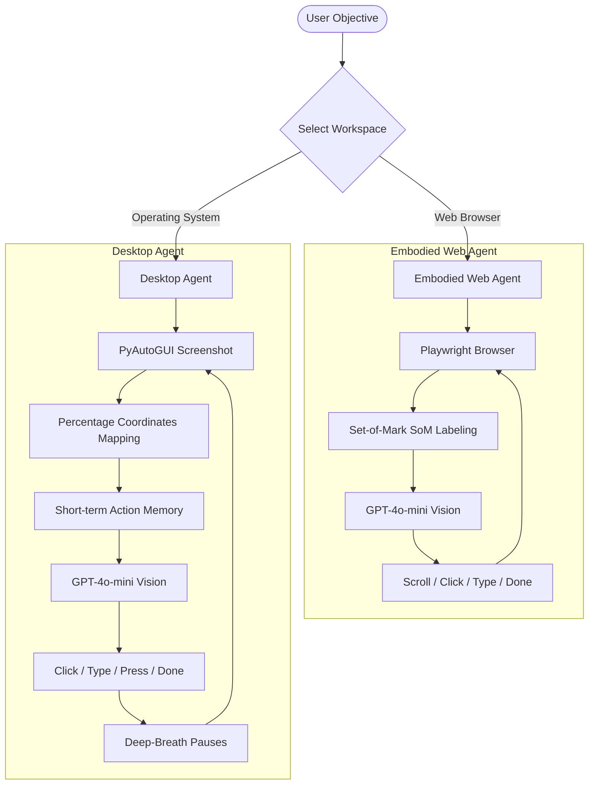

# 🤖 Embodied AI & Desktop Agent Ecosystem

[]()
[]()
[]()
[]()

Welcome to the **Embodied AI & Desktop Agent Ecosystem**! This unified repository hosts two ultra-powerful, vision-driven autonomous AI agents designed to handle complex human objectives across web environments and local operating systems.

By combining OpenAI’s **GPT-4o-mini** multimodal vision engine with custom-built low-level action drivers, these agents see what a human sees and act precisely as a human would.

---

## 🗺️ Architecture Overview

The codebase is split into two specialized AI agents depending on your automation workspace:



---

## ✨ Primary Features

### 1. 🌍 Embodied Web Agent (`src/agent/embodied_agent.py`)
*   **Vision-Driven Set-of-Mark (SoM):** Overlays interactive visual tags onto interactive page components so the VLM can target exact web elements without inspect-element DOM parsing.
*   **Human-like Browser Logic:** Custom scrolling, selective keyboard clearing, and double-press execution to bypass complex React/Single Page Application event listeners.
*   **Automatic Markdown Reporting:** Autogenerates a beautiful `run_report.md` after completion, highlighting every decision, thought, and screenshot step.

### 2. 🖥️ Autonomous Desktop Agent (`src/desktop_agent.py`)
*   **Universal OS Control:** Drives actual desktop software (Notepad, Calculator, Command Prompt, etc.) using pixel-independent coordinate percentage mapping.
*   **🧠 Short-Term Prompt Memory:** Caches previous operations inside an execution memory stream (`self.last_action`), reminding the VLM what it just did to completely destroy infinite hallucination/repetition loops.
*   **🐢 "Deep Breath" Delays:** Smart delays built between keyboard typing, OS search engine indexing, and window render cycles to ensure high-latency actions execute perfectly.
*   **🛑 FAANG-Grade Safety Killswitch:** Direct integration of `pyautogui.FAILSAFE`. If the AI starts acting unexpectedly, instantly slam the physical mouse cursor into any of the 4 screen corners to terminate the thread instantly.

---

## 🛠️ Installation & Setup

### 📋 Prerequisites
*   Python 3.9 or higher installed.
*   An OpenAI API Key with access to `gpt-4o-mini`.

### 1. Clone & Navigate
```bash
git clone https://github.com/souravppm/EmbodiedAIAgent.git
cd EmbodiedAIAgent
```

### 2. Create and Activate Virtual Environment
On **Windows (PowerShell)**:
```powershell
python -m venv venv
.\venv\Scripts\Activate.ps1
```

On **macOS / Linux**:
```bash
python3 -m venv venv
source venv/bin/activate
```

### 3. Install Dependencies
```bash
pip install -r requirements.txt
playwright install chromium
```

### 4. Configure Environments
Create a `.env` file in the root directory:
```env
OPENAI_API_KEY=your_openai_api_key_here
```

---

## 🏃 Running the Agents

> [!WARNING]
> When running the **Desktop Agent**, the model controls your physical mouse and keyboard. **Keep your hands clear of the controls** while the program is actively processing a task. Use the safety corners if you need to abort!

### A. Run the Web Agent (Playwright Browser)
Instruct the agent to open a specific website and perform a multi-step objective autonomously:
```bash
python src/main.py --url "https://github.com" --task "Find the top trending repositories"
```
*Add the `--headless` flag to run the web automation quietly in the background without launching the physical Chromium window.*

### B. Run the Desktop Agent (Full OS Automation)
Provide any natural language instruction for your desktop computer:
```bash
python src/desktop_agent.py --task "Press the 'win' key, wait a second, type 'Calculator', open it, and type '789 + 123'."
```

---

## 🔬 Core Components & Tools

| Component File | Role | Tech Stack |
| :--- | :--- | :--- |
| **[`src/main.py`](file:///C:/Projects/EmbodiedAIAgent/src/main.py)** | CLI Entry Point for Web Agent | argparse, Python |
| **[`src/desktop_agent.py`](file:///C:/Projects/EmbodiedAIAgent/src/desktop_agent.py)** | Complete Autonomous OS Automation Engine | OpenAI API, PyAutoGUI, Memory Caching |
| **[`src/agent/embodied_agent.py`](file:///C:/Projects/EmbodiedAIAgent/src/agent/embodied_agent.py)** | Web Crawler Agent containing Decision Loop | Playwright, OpenAI Vision, Set-of-Mark |
| **[`src/tools/browser_env.py`](file:///C:/Projects/EmbodiedAIAgent/src/tools/browser_env.py)** | Browser state snapshotting, element boundary calculations | Playwright, BeautifulSoup |

---

## 📝 License
This project is licensed under the MIT License. Feel free to copy, modify, and build upon it!

---
*Created with ❤️ by Sourav Kumar Das.*
